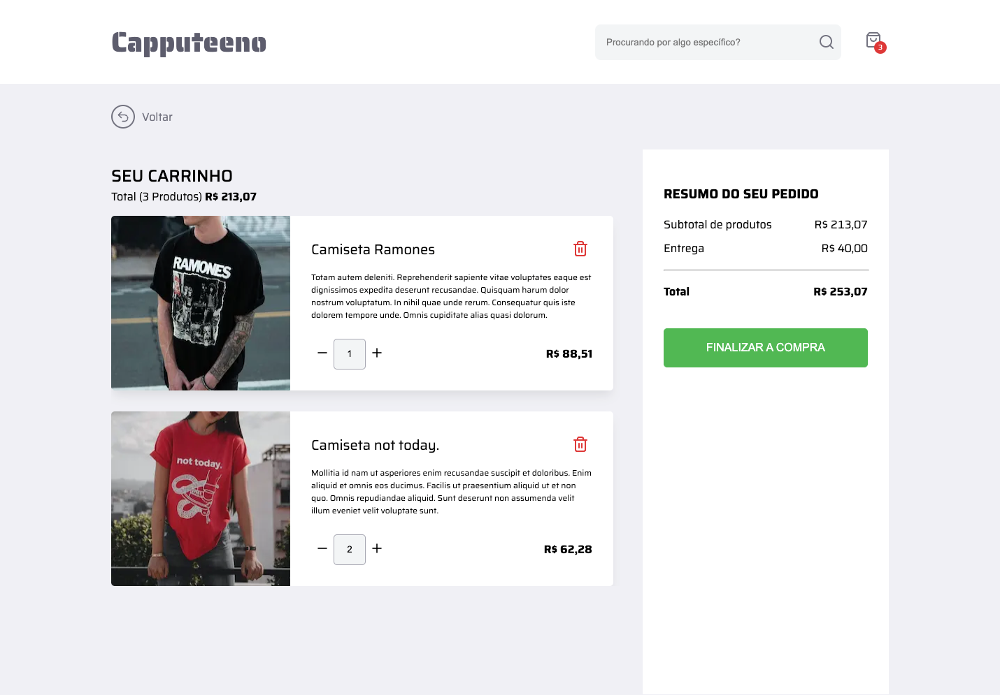
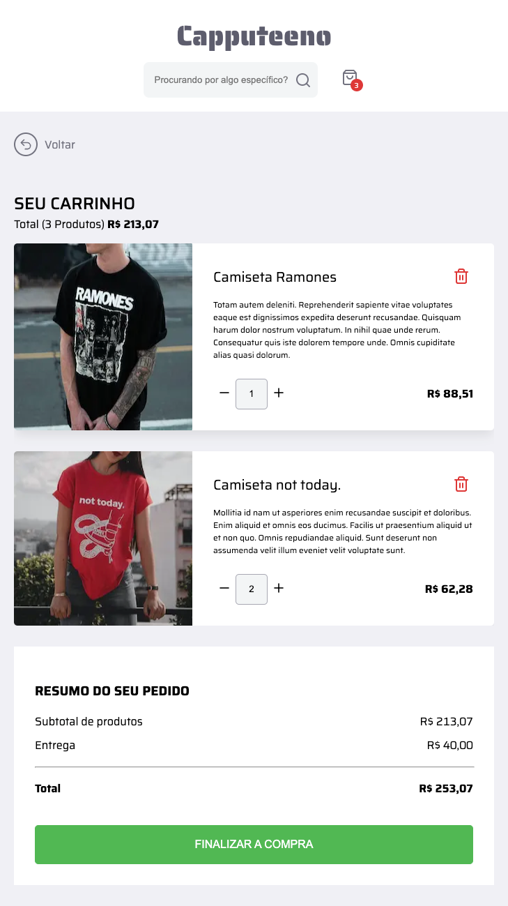
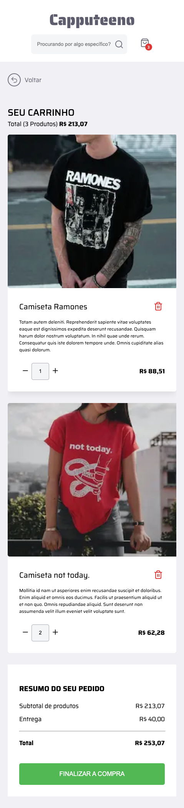

# 🚀 Front end challenge

O objetivo deste desafio é desenvolver um protótipo de e-commerce utilizando nextJS 14 e react query.


# 🧠 Contexto


O desafio será implementar um e-commerce para venda de canecas e camisetas que deverá ter as seguintes funcionalidades:
- [x] Catálogo de produtos com paginação
- [x] Filtragem produtos por categoria
- [x] Busca por nome do produto
- [x] Adicionar e remover produtos do carrinho
- [x] Responsividade
- [x] Finalizar compra

## 📋 Todo
- [ ] Página 404
- [ ] Tratar possiveis erros de request

## 😎 Resultados
- Você pode acessar o resultado neste link: https://frontend-challenge-rocketseat.vercel.app/




## How to run the project locally
To run the frontend application simply enter the frontend folder and create a .env.local enter the graphql server host and run the command
```
pnpm install
pnpm dev
```


To run the backend application simply enter the frontend folder and run the command
```
pnpm install
pnpm start
```

And you're all set :)

---
